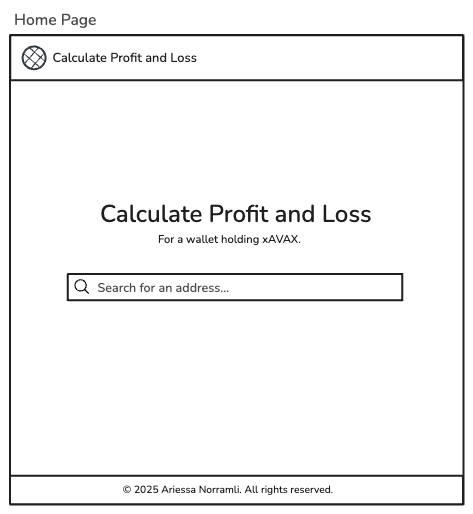
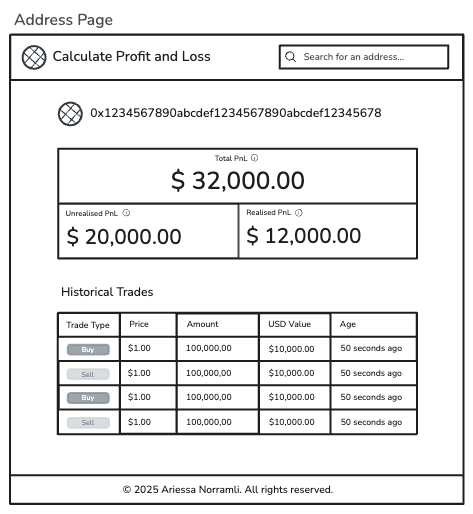
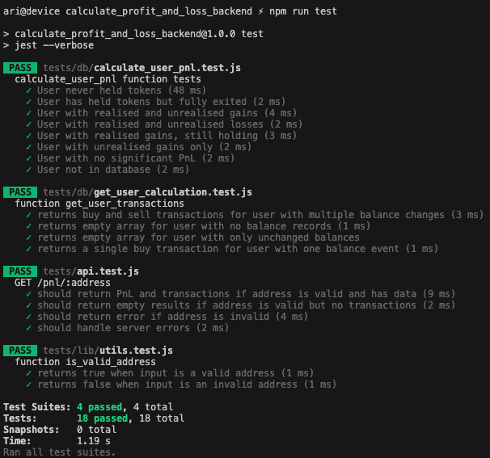

# Calculate Profit and Loss - Backend

Calculate the profit and loss (PnL) of a wallet address that holds xAVAX tokens.

<br />

**Table of Contents**

- [Tech Stack](#tech-stack)
- [System Architecture Diagram](#system-architecture-diagram)
- [Entity Relationship Diagram](#entity-relationship-diagram)
- [Low Fidelity Wireframes](#low-fidelity-wireframes)
  - [Home Page](#home-page)
  - [Address Page](#address-page)
- [Installation](#installation)
  - [Prerequisites](#prerequisites)
  - [Setup](#setup)
- [Tests](#tests)
  - [How to Run the Tests](#how-to-run-the-tests)
  - [Unit Tests Covered](#unit-tests-covered)
- [Database Functions](#database-functions)
  - [Calculate User's Profit and Loss (PnL)](#calculate-users-profit-and-loss-pnl)
  - [Get User's transactions](#get-users-transactions)
- [API Endpoint](#api-endpoint)
  - [GET /pnl/:address](#get-pnladdress)
- [License](#license)

<br />

## Tech Stack

- **Backend:** Node.js, Express.js
- **Database:** PostgreSQL
- **Data Source:** Indexed data via Dune Analytics queries
- **Testing:** Jest
- **Infrastructure:** Docker, Bash Scripts
- **Tooling & Automation:** Makefile, jq, curl

<br />

## System Architecture Diagram


This project seeds the PostgreSQL database with data sourced from Dune Analytics.

The fetch_dune_query.sh script uses the official Dune API to execute queries and retrieve results. The queries collect daily xAVAX token prices and daily token balances for wallet holders. Raw query results are saved in the query_results directory.

The files token_prices.csv and user_balances.csv are cleaned and formatted versions of the raw data, structured to match the database schema:

- token_prices: Contains timestamped snapshots of token prices.
- user_balances: Contains wallet balances over time.

Headers have been updated to align with the database column names. Any NULL values in user balances have been replaced with 0 to ensure data consistency and prevent import issues. Only data related to xAVAX tokens was retained in the token_prices dataset.

<br />

## Entity Relationship Diagram


<br />

## Low Fidelity Wireframes

### Home Page



<br />

### Address Page



<br />

## Installation

### Prerequisites

All installation instructions are geared for macOS Apple Silicon system. By default, all UNIX-based and Linux-based system are already installed with `make`.

For Windows system, `make` can be installed using 3 ways:

- Using Make for Windows
- Using chocolatey to install make
- Using Windows Subsystem for Linux (WSL2)

<br />

### Setup

- Clone the repository

- Create a `.env` file based on `.env.example` file

- Build and start Docker containers

```bash
make up
```

<br />

## Tests

### How to Run the Tests

Get a list of unit tests and their verbose results

```bash
make tests
```



<br />

### Unit Tests Covered

- Database functions
  - get_user_transactions
    - returns buy and sell transactions for user with multiple balance changes
    - returns empty array for user with no balance records
    - returns empty array for user with only unchanged balances
    - returns a single buy transaction for user with one balance event
  - calculate_user_pnl
    - User never held tokens
    - User has held tokens but fully exited
    - User with realised and unrealised gains
    - User with realised and unrealised losses
    - User with realised gains, still holding
    - User with unrealised gains only
    - User with no significant PnL
    - User not in database

- Utility Functions
  - is_valid_address
    - returns true when input is a valid address
    - returns false when input is an invalid address

- API Endpoints
  - GET /pnl/:address
    - should return PnL and transactions if address is valid and has data
    - should return empty results if address is valid but no transactions
    - should return error if address is invalid
    - should handle server errors

<br />

## Database Functions

### Calculate User's Profit and Loss (PnL)

This PostgreSQL function computes the profit and loss (PnL) summary for a given user address by analyzing their transaction history and token holdings.

The function returns:

- Realised PnL: The total profit or loss from completed (closed) trades.
- Unrealised PnL: The current profit or loss from open positions still held.
- Total PnL: The combined value of realised and unrealised PnL.
- PnL Description: A brief textual summary describing the user’s current PnL status.

**Average Cost Basis Formula, P(avg)**

Let:

- Q(i) = amount of tokens bought in trade i
- P(i) = price per token bought in trade i
- Total amount held = ∑Q(i)
- Total cost = ∑(Qi \* P(i))

Then:

P(avg) = (∑(Q(i) \* P(i))) / ∑Q(i)

<br />

**Realised PnL Formula, Pnl(R)**

Let:

- Q(sell) = amount of tokens sold
- P(sell) = price at which tokens are sold
- P(avg) = average cost basis of tokens held

Then:

Pnl(R) = (P(sell) - P(avg)) \* Q(sell)

<br />

**Unrealised PnL Formula, Pnl(U)**

Let:

- P(current) = current price of token
- Q(current) = current amount of tokens in holding

Then:

Pnl(U) = (P(current) - P(avg)) \* Q(current)

<br />

**Total PnL Formula, PnL(T)**

Let:

- Pnl(R) = realised PnL
- PnL(U) = unrealised PnL

Then:

PnL(T) = Pnl(R) + Pnl(U)

<br />

**Example**

Assume current date is 04/01/2024 and user address is 0x1234567890abcdef1234567890abcdef12345678.

Table token_prices
| snapshot_date | price_in_usd |
| --- | --- |
| 2024-01-01 00:00:00+00 | 1.25 |
| 2024-01-02 00:00:00+00 | 1.30 |
| 2024-01-03 00:00:00+00 | 1.28 |
| 2024-01-04 00:00:00+00 | 1.35 |

Table user_balances
| user_address | snapshot_date | balance |
| --- | --- | --- |
| 0x1234567890abcdef1234567890abcdef12345678 | 2024-01-01 00:00:00.000 UTC | 0 |
| 0x1234567890abcdef1234567890abcdef12345678 | 2024-01-02 00:00:00.000 UTC | 100 |
| 0x1234567890abcdef1234567890abcdef12345678 | 2024-01-03 00:00:00.000 UTC | 50 |

<br />

**Calculation**

Ignoring all zero balances, the trades can be classified as follows:

- Buy 100 tokens @ $1.30 on 2024-01-02 00:00:00.000 UTC
- Sell 50 tokens @ $1.28 on 2024-01-03 00:00:00.000 UTC

```
Average Cost Basis, P(avg) = 1.30
Sell Price, P(sell) = 1.28
Tokens Sold, Q(sell) = 100 - 50 = 50
Current Token Price, P(current) = 1.35
Amount of Token Holdings, Q(current) = 100 - 50 = 50

Realised PnL ($)
= (P(sell) - P(avg)) * Q(sell)
= (1.28 - 1.30) * 50
= -1

Unrealised PnL ($)
= (P(current) - P(avg)) * Q(current)
= (1.35 - 1.30) * 50
= 2.5

Total PnL ($)
= -1 + 2.5
= 1.5
```

<br />

### Get User's Transactions

This PostgreSQL function retrieves the historical transaction activity of a specific user wallet based on their token balance changes over time. Each transaction is inferred from a change in balance and is labeled as a buy (increase in balance) or sell (decrease in balance).

The function also calculates:

- `price_in_usd`: Estimated token price at the time of the transaction.
- `value_in_usd`: USD value of the token amount involved in the transaction.

<br />

## API Endpoint

### GET /pnl/:address

Fetches the profit and loss (PnL) summary and detailed transaction history for a given Avalanche C-Chain wallet address.

<br />

**Path Parameters**

- `address` (string): The wallet address to query. Must be a valid Avalanche C-Chain address.

<br />

**Success Response**

Returns a JSON object with:

- `address`: the wallet queried
- `pnl`: calculated profit and loss data
- `transactions`: an array of buy/sell activities

<br />

**Example Response (200 OK)**

```json
{
  "address": "0xabc1234567890defabc1234567890defabc12345",
  "pnl": {
    "realised_pnl": 102.5,
    "unrealised_pnl": -0.75,
    "total_pnl": 101.75,
    "pnl_description": "Realised gains, still holding"
  },
  "transactions": [
    {
      "timestamp": "2025-04-01",
      "type": "buy",
      "amount": 150.0,
      "price_usd": 0.67,
      "value_usd": 100.5,
      "age": "2 months ago"
    },
    {
      "timestamp": "2025-05-20",
      "type": "sell",
      "amount": -60.0,
      "price_usd": 1.7,
      "value_usd": -102.0,
      "age": "2 weeks ago"
    }
  ]
}
```

<br />

**Error Responses**

- Invalid Address (200 OK with error field)

  If the provided address is not valid:

  ```json
  {
    "error": "Invalid address"
  }
  ```

<br />

- Internal Server Error (500)

  If an unexpected error occurs while fetching or computing data:

  ```json
  {
    "error": "Internal server error"
  }
  ```

<br />

**Notes**

- Transactions only appear if there is at least one balance change (balance_change ≠ 0).

- `pnl_description` provides a human-readable summary based on realised and unrealised gains.

<br />

## License

Calculate Profit and Loss - Backend is licensed under the [GNU GPLv3 License](LICENSE).
