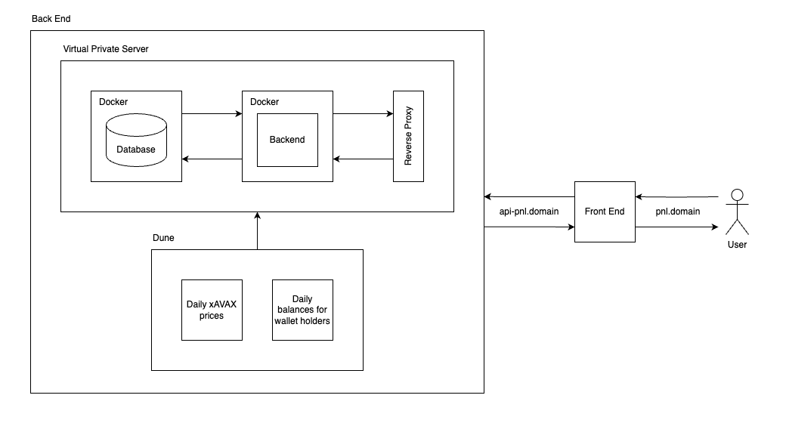

# Calculate Profit and Loss - Backend

Calculate the profit and loss (PnL) of a wallet address that holds xAVAX tokens.

<br />

**Table of Contents**

- [Tech Stack](#tech-stack)
- [System Architecture Diagram](#system-architecture-diagram)
- [Entity Relationship Diagram](#entity-relationship-diagram)
- [Low Fidelity Wireframes](#low-fidelity-wireframes)
- [Installation](#installation)
    - [Prerequisites](#prerequisites)
    - [Setup](#setup)
- [Tests](#tests)
    - [How to Run the Tests](#how-to-run-the-tests)
- [Database Functions](#database-functions)
    - [Calculate User's Profit and Loss (PnL)](#calculate-users-profit-and-loss-pnl)
        - [Realised PnL](#realised-pnl)
        - [Unrealised PnL](#unrealised-pnl)
        - [Total PnL](#total-pnl)
    - [Get User's transactions](#get-users-transactions)
- [API Endpoint](#api-endpoint)
    - [GET /pnl/:address](#get-pnladdress)
- [License](#license)

<br />

## Tech Stack

- **Backend:** Node.js, Express.js
- **Database:** PostgreSQL
- **Data Source:** Indexed data via Dune Analytics queries
- **Testing:** Jest
- **Infrastructure:** Docker, Bash Scripts
- **Tooling & Automation:** Makefile, jq, curl

<br />

## System Architecture Diagram



This project seeds the PostgreSQL database with data sourced from Dune Analytics.

The fetch_dune_query.sh script uses the official Dune API to execute queries and retrieve results. The queries collect daily xAVAX token prices and daily token balances for wallet holders. Raw query results are saved in the query_results directory.

The files token_prices.csv and user_balances.csv are cleaned and formatted versions of the raw data, structured to match the database schema:

- token_prices: Contains timestamped snapshots of token prices.
- user_balances: Contains wallet balances over time.

Headers have been updated to align with the database column names. Any NULL values in user balances have been replaced with 0 to ensure data consistency and prevent import issues. Only data related to xAVAX tokens was retained in the token_prices dataset.

<br />

## Entity Relationship Diagram


<br />

## Low Fidelity Wireframes


<br />

## Installation

### Prerequisites

All installation instructions are geared for macOS Apple Silicon system. By default, all UNIX-based and Linux-based system are already installed with `make`.

For Windows system, `make` can be installed using 3 ways:

- Using Make for Windows
- Using chocolatey to install make
- Using Windows Subsystem for Linux (WSL2)

<br />

### Setup

- Clone the repository

- Create a `.env` file based on `.env.example` file

- Build and start Docker containers

```bash
make up
```

<br />

## Tests

### How to Run the Tests

Get a list of unit tests and their verbose results

```bash
make tests
```

<br />

## Database Functions

### Calculate User's Profit and Loss (PnL)

#### Realised PnL

**Average Cost Basis Formula, P(avg)**

Let:

- Q(i) = amount of tokens bought in trade i
- P(i) = price per token bought in trade i
- Total amount held = ∑Q(i)
- Total cost = ∑(Qi * P(i))

Then:

P(avg) = (∑(Q(i) * P(i))) / ∑Q(i) 

<br />

**Realised PnL Formula**

Let:

- Q(sell) = amount of tokens sold
- P(sell) = price at which tokens are sold
- P(avg) = average cost basis of tokens held

Then:

Realised PnL = (P(sell) - P(avg)) * Q(sell)

<br />

**Example**

Assume current date is 04/01/2024 and user address is 0x1234567890abcdef1234567890abcdef12345678.

Table token_prices
| snapshot_date | price_in_usd |
| --- | --- |
| 2024-01-01 00:00:00+00 | 1.25 |
| 2024-01-02 00:00:00+00 | 1.30 |
| 2024-01-03 00:00:00+00 | 1.28 |
| 2024-01-04 00:00:00+00 | 1.35 |

Table user_balances
| user_address | snapshot_date | balance |
| --- | --- | --- |
| 0x1234567890abcdef1234567890abcdef12345678 | 2024-01-01 00:00:00.000 UTC | 0 |
| 0x1234567890abcdef1234567890abcdef12345678 | 2024-01-02 00:00:00.000 UTC | 100 |
| 0x1234567890abcdef1234567890abcdef12345678 | 2024-01-03 00:00:00.000 UTC | 50 |

<br />

**Calculation**

Ignoring all zero balances, the trades can be classified as follows:

- Buy 100 tokens @ $1.30 on 2024-01-02 00:00:00.000 UTC
- Sell 50 tokens @ $1.28 on 2024-01-03 00:00:00.000 UTC

```
Average Cost Basis, P(avg) = 1.30
Sell Price, P(sell) = 1.28
Tokens Sold, Q(sell) = 100 - 50 = 50

Realised PnL ($)
= (P(sell) - P(avg)) * Q(sell)
= (1.28 - 1.30) * 50
= -1
```

<br />

#### Unrealised PnL

**Average Cost Basis Formula, P(avg)**

Let:

- Q(i) = amount of tokens bought in trade i
- P(i) = price per token bought in trade i
- Total amount held = ∑Q(i)
- Total cost = ∑(Qi * P(i))

Then:

P(avg) = (∑(Q(i) * P(i))) / ∑Q(i) 

<br />

**Unrealised PnL Formula**

Let:

- P(current) = current price of token
- Q(current) = current amount of tokens in holding

Then:

Unrealised PnL = (P(current) - P(avg)) * Q(current)

<br />

**Example**

Assume current date is 04/01/2024 and user address is 0x1234567890abcdef1234567890abcdef12345678.

Table token_prices
| snapshot_date | price_in_usd |
| --- | --- |
| 2024-01-01 00:00:00+00 | 1.25 |
| 2024-01-02 00:00:00+00 | 1.30 |
| 2024-01-03 00:00:00+00 | 1.28 |
| 2024-01-04 00:00:00+00 | 1.35 |

Table user_balances
| user_address | snapshot_date | balance |
| --- | --- | --- |
| 0x1234567890abcdef1234567890abcdef12345678 | 2024-01-01 00:00:00.000 UTC | 0 |
| 0x1234567890abcdef1234567890abcdef12345678 | 2024-01-02 00:00:00.000 UTC | 100 |
| 0x1234567890abcdef1234567890abcdef12345678 | 2024-01-03 00:00:00.000 UTC | 50 |

<br />

**Calculation**

Ignoring all zero balances, the trades can be classified as follows:

- Buy 100 tokens @ $1.30 on 2024-01-02 00:00:00.000 UTC
- Sell 50 tokens @ $1.28 on 2024-01-03 00:00:00.000 UTC

```
Average Cost Basis, P(avg) = 1.30
Current Token Price, P(current) = 1.35
Amount of Token Holdings, Q(current) = 100 - 50 = 50

Unrealised PnL ($)
= (P(current) - P(avg)) * Q(current)
= (1.35 - 1.30) * 50
= 2.5
```

<br />

#### Total PnL

**Formula**

Total PnL = Realised PnL + Unrealised PnL

<br />

**Example**

Assume current date is 04/01/2024 and user address is 0x1234567890abcdef1234567890abcdef12345678.

Table token_prices
| snapshot_date | price_in_usd |
| --- | --- |
| 2024-01-01 00:00:00+00 | 1.25 |
| 2024-01-02 00:00:00+00 | 1.30 |
| 2024-01-03 00:00:00+00 | 1.28 |
| 2024-01-04 00:00:00+00 | 1.35 |

Table user_balances
| user_address | snapshot_date | balance |
| --- | --- | --- |
| 0x1234567890abcdef1234567890abcdef12345678 | 2024-01-01 00:00:00.000 UTC | 0 |
| 0x1234567890abcdef1234567890abcdef12345678 | 2024-01-02 00:00:00.000 UTC | 100 |
| 0x1234567890abcdef1234567890abcdef12345678 | 2024-01-03 00:00:00.000 UTC | 50 |

<br />

**Calculation**

Ignoring all zero balances, the trades can be classified as follows:

- Buy 100 tokens @ $1.30 on 2024-01-02 00:00:00.000 UTC
- Sell 50 tokens @ $1.28 on 2024-01-03 00:00:00.000 UTC

```
Average Cost Basis, P(avg) = 1.30
Sell Price, P(sell) = 1.28
Tokens Sold, Q(sell) = 100 - 50 = 50
Current Token Price, P(current) = 1.35
Amount of Token Holdings, Q(current) = 100 - 50 = 50

Realised PnL ($)
= (P(sell) - P(avg)) * Q(sell)
= (1.28 - 1.30) * 50
= -1

Unrealised PnL ($)
= (P(current) - P(avg)) * Q(current)
= (1.35 - 1.30) * 50
= 2.5

Total PnL ($)
= -1 + 2.5
= 1.5
```

<br />

### Get User's Transactions

<br />

## API Endpoint

### GET /pnl/:address

<br />

## License

Calculate Profit and Loss - Backend is licensed under the [GNU GPLv3 License](LICENSE).
